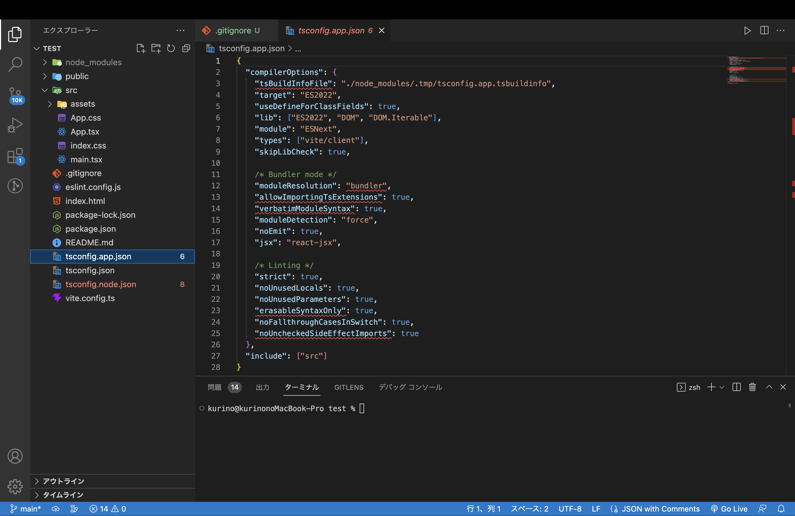
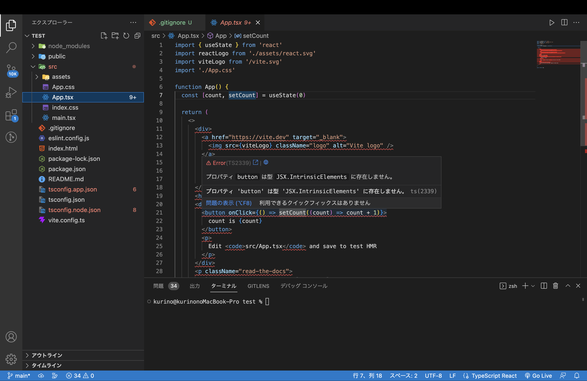
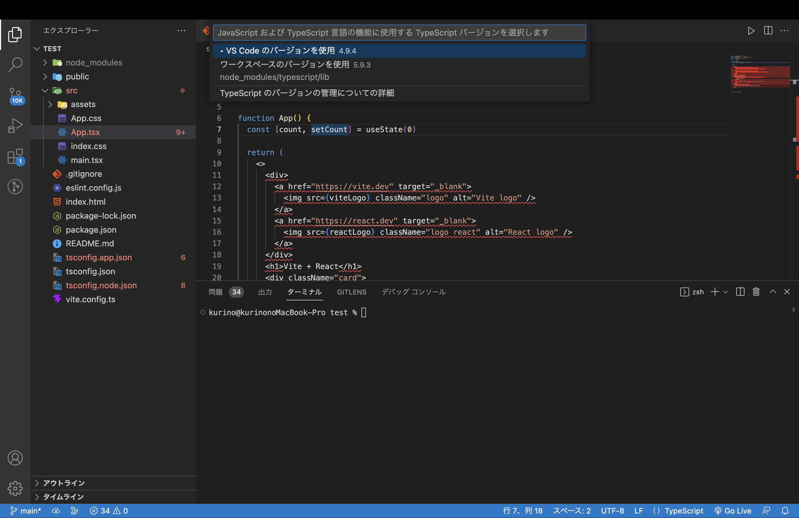

## はじめに

手っ取り早くReactアプリを作りたかったので `npm create vite@latest` を実行したのですが、VSCode上でエラーが出ました。
ネットで同じエラーの人が見つからず自分の環境固有の問題かと思いましたが、原因を調べると仕組みの話で納得感のある解決ができたので記録しておきます。

## エラー内容

```bash
npm create vite@latest
```

を実行してプロジェクトを作成し、VSCodeで開くと `tsconfig.app.json` と `App.tsx` でエラーが発生していました。





## 原因

### VSCodeは独自のTypeScriptを持っている

`npm install` を実行すると `package.json` に記載のTypeScript（5.x系）は `node_modules/typescript` にインストールされます。
しかし **VSCodeのエディタ機能（IntelliSense・型チェック）はデフォルトでVSCode本体に同梱されたTypeScriptを使います**。`node_modules` のTypeScriptは参照しません。

これはVSCodeの意図的な設計で、「プロジェクトにTypeScriptがインストールされていなくてもエディタが動く」ようにするためです。

```
npm install → node_modules/typescript@5.x ✅ インストール済み
                                                ↑
                                           VSCodeは参照しない

VSCode → 同梱の typescript@4.9.3 で型チェック → エラー
```

### なぜエラーになるのか

Viteが生成する `tsconfig.app.json` はTypeScript 5.0以降で追加された設定を使っています。

```json
{
  "compilerOptions": {
    "moduleResolution": "bundler"  // TypeScript 5.0で追加されたオプション
  }
}
```

VSCode同梱の古いTypeScript（4.9.3）はこのオプションを知らないため、エラーとして扱ってしまいます。



## 解決方法

VSCodeが参照するTypeScriptを、同梱のものからワークスペース（`node_modules`）のものに切り替えます。

1. コマンドパレットを開く（`Cmd + Shift + P`）
2. 「TypeScript: Select TypeScript Version」を選択
3. 「ワークスペースのバージョンを使用 5.x.x」を選択

これで解決！

