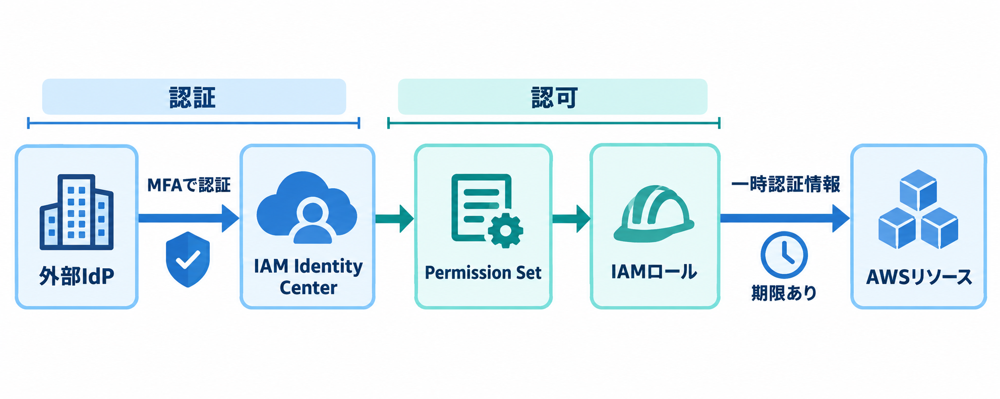

AWSのユーザー管理と、MFAを強制する方法について調べたことのアウトプット。

## はじめに

「各ユーザーにMFAを必須にするにはどうすればよいか」「IAMユーザーとIAM Identity Centerはどう使い分けるのか」が気になったので調べました。

この記事では、AWSのベストプラクティスをもとに、次の点を整理します。

- IAMユーザーとIAM Identity Centerの違い
- IAM Identity CenterでMFAを強制する方法
- IAMユーザーを残す場合のMFA対策
- MFAとアクセスキーの関係

## まず結論

人間がAWSコンソールやAWS CLIを使う場合は、長期的な認証情報を持つIAMユーザーよりも、フェデレーションによる一時的な認証情報を使う構成が推奨されています。複数のAWSアカウントを組織で管理する場合は、IAM Identity Centerを使うのが代表的な方法です。

ただし、IAM Identity Centerを導入すればMFAが自動的に必須になるわけではありません。IAM Identity Centerの設定で、ユーザーにMFAデバイスの登録と利用を要求する必要があります。

また、IAMユーザーにMFAを設定しても、アクセスキーによるCLI・API操作が自動的にMFA必須になるわけではありません。MFAとアクセスキーは別の論点として考える必要があります。

## IAMユーザーとIAM Identity Centerの違い

### IAMユーザー

IAMユーザーは、特定のAWSアカウント内に作成するユーザーです。ユーザーごとにコンソールのパスワードやアクセスキーなどの認証情報を持たせることができます。

一方で、IAMユーザーの認証情報は長期間有効になる可能性があります。退職や異動の際に、ユーザー・パスワード・アクセスキー・MFAデバイスなどを漏れなく無効化・削除する必要があり、運用での管理負担が大きくなります。

そのため、IAMユーザーは「古いから絶対に使えない」というものではありませんが、人間のユーザー用には原則として第一の選択肢にしない、という位置づけです。特定のツールとの互換性など、フェデレーションを利用できないケースでは、例外的に利用します。

### IAM Identity Center

IAM Identity Centerは、組織内のユーザーやグループに対して、複数のAWSアカウントへのアクセスをまとめて割り当てるための仕組みです。

ユーザーの認証元には、次のような選択肢があります。

- IAM Identity Center内のディレクトリ
- AWS Managed Microsoft ADやAD Connector
- Microsoft Entra ID、Okta、Google Workspaceなどの外部IdP

ユーザーがAWSにサインインすると、割り当てられたPermission SetをもとにAWSアカウント内のIAMロールを利用します。人間が長期的なIAMユーザーのアクセスキーを持ち続けるのではなく、必要な期間だけ使える一時的な認証情報を取得する点が重要です。

## フェデレーションとは

フェデレーションは、AWSの外部にある認証基盤でユーザーを認証し、その結果を使ってAWSのロールを利用する仕組みです。

たとえば、次のような流れになります。

```text
会社の認証基盤（Microsoft Entra ID、Okta、Google Workspaceなど）
        ↓ ユーザーを認証
IAM Identity Center
        ↓ Permission Setに対応する権限を割り当て
AWSアカウント内のIAMロール
        ↓
一時的な認証情報でAWSを操作
```



図の左側が「認証」、右側が「認可」です。外部IdPで本人確認を行ったあと、Permission SetをもとにIAMロールを利用し、期限付きの一時認証情報でAWSリソースを操作します。

認証を会社のID基盤に任せ、AWS側ではユーザーやグループへのアクセス割り当てと、ロールに相当する権限を管理します。そのため、退職者のアカウントをAWSアカウントごとに探して削除するよりも、会社のID基盤側でアカウントを無効化しやすくなります。

ただし、実際にどこでユーザーを無効化するかは、採用するアイデンティティソースの構成によって変わります。IAM Identity Center内でユーザーを管理するのか、外部IdP側で管理するのかをあらかじめ決める必要があります。

## IAM Identity CenterでMFAを強制する

IAM Identity Centerでは、設定画面のAuthenticationからMFAを設定できます。ユーザーがMFAデバイスを登録していない場合に、サインイン時の登録を必須にする設定が代表的です。

ただし、MFAの設定場所はアイデンティティソースによって異なります。IAM Identity Centerのディレクトリなどを使う場合はIAM Identity Center側で設定しますが、Microsoft Entra IDやOktaなどの外部IdPを使う場合は、基本的に外部IdP側のMFAポリシーで制御します。

大まかな流れは次のとおりです。

1. IAM Identity Centerの設定を開く
2. AuthenticationからMFAの設定を開く
3. 利用可能なMFA方式を設定する
4. MFAデバイス未登録のユーザーに、サインイン時の登録を要求する
5. 必要に応じて、既存のMFAユーザーにもサインイン時の再認証を要求する

これにより、IAM Identity Center経由でAWSへアクセスするユーザーに対して、MFAを前提としたログインフローを構成できます。

## IAMユーザーのMFAを強制する場合

すでにIAMユーザーを利用していて、すぐに構成を変更できない場合は、まずIAMユーザーにMFAを設定します。これは短期的な止血として有効です。

さらに、IAMポリシーで次のような制御を行い、MFAを設定していないユーザーが通常のAWS操作を実行できないようにする方法があります。

- MFAデバイスの登録・変更など、MFA設定に必要な操作だけを許可する
- MFA未使用の場合は、通常のAWS操作を拒否する
- ルートユーザーにもMFAを設定する
- 不要なIAMユーザー、パスワード、アクセスキーを棚卸しして削除する

ただし、ここで注意が必要です。コンソールへのログイン時にMFAを要求することと、AWS CLI・APIの操作時にMFAを要求することは別の制御です。

## MFAとアクセスキーは別に考える

IAMユーザーにMFAデバイスを登録しても、そのユーザーの長期アクセスキーが残っていれば、アクセスキーを使ったCLI・API操作が可能な場合があります。

つまり、次の2つは別々に確認する必要があります。

| 確認対象 | 確認すること |
| --- | --- |
| コンソールログイン | パスワードに加えてMFAを要求しているか |
| CLI・API操作 | 長期アクセスキーを使っていないか。必要ならMFA付きの一時認証情報を要求しているか |

人間がCLIやSDKを利用する場合も、IAM Identity Centerから一時的な認証情報を取得する方法があります。長期アクセスキーを個人に配布する必要がなくなるため、アクセスキーの漏洩や退職時の回収漏れといったリスクを下げられます。

## 今回の整理

今回調べた内容を、運用の優先順位として整理すると次のようになります。

1. 既存のIAMユーザーとアクセスキーを棚卸しする
2. すぐに変更できる範囲で、IAMユーザーとルートユーザーにMFAを設定する
3. IAMユーザーのコンソールログインにMFAを強制する
4. 長期アクセスキーを利用しているユーザーやツールを確認する
5. 人間のユーザーはIAM Identity Centerと一時的な認証情報へ移行する
6. IAMユーザーを残す場合は、利用目的を明確にして定期的に見直す

## まとめ

- 人間のユーザーには、長期認証情報を持つIAMユーザーより、フェデレーションと一時的な認証情報を使う構成が推奨されている
- 複数AWSアカウントのユーザーアクセスを一元管理する場合、IAM Identity Centerが有力な選択肢になる
- IAM Identity Centerでも、設定画面でMFAの登録・利用を要求する必要がある
- IAMユーザーのMFA設定と、アクセスキーによるCLI・API操作の制御は別に考える
- IAMユーザーは完全に不要なのではなく、フェデレーションを利用できない場合などに限定して使う

## 参考

- [AWS IAMのセキュリティのベストプラクティス](https://docs.aws.amazon.com/IAM/latest/UserGuide/best-practices.html)
- [IAM Identity CenterでMFAデバイスの強制を設定する](https://docs.aws.amazon.com/singlesignon/latest/userguide/how-to-configure-mfa-device-enforcement.html)
- [IAM Identity CenterユーザーのAWS CLI・SDK用認証情報を取得する](https://docs.aws.amazon.com/singlesignon/latest/userguide/howtogetcredentials.html)
