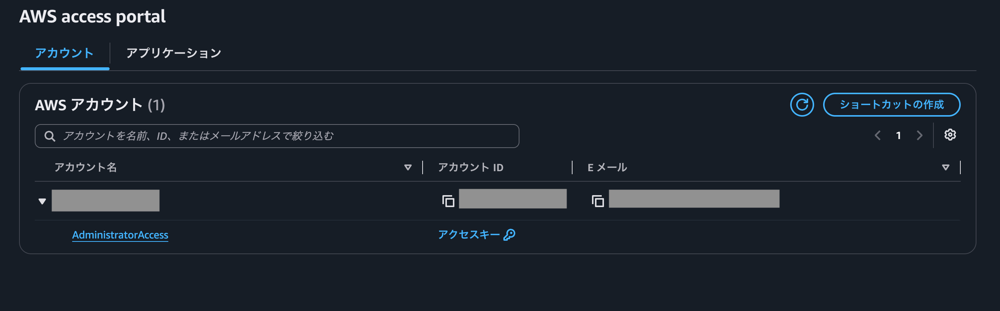

## はじめに

Terraformを使ってAWSリソースを操作したかったので、その前準備としてTerraformのインストール、aws cliインストール、AWS IAM Identity Center（旧AWS SSO）で作業用ユーザーを作成し、AWS CLIからSSO認証できる状態にしました。その時のメモです。

## 1. AWS CLIをインストールする

macOSでは、Homebrewを使ってAWS CLIをインストールできます。

この記事では、実際に使用したHomebrew経由の方法でインストールします。AWS公式ドキュメントでは、macOS向けにインストールスクリプトやインストーラーを使う方法も案内されています。

```bash
brew install awscli
```

インストール後、バージョンを確認します。バージョン確認には`aws -v`ではなく`aws --version`を使います。

```bash
aws --version
```

出力例：

```text
aws-cli/2.33.17 Python/3.13.11 Darwin/25.5.0 exe/arm64
```

## 2. IAM Identity Centerでユーザーを作成する

AWS Management Consoleで、次の設定を行う。

1. IAM Identity Centerで作業用ユーザーを作成する(マルチアカウントのアクセス許可 > AWSアカウントから作成)
2. 対象のAWSアカウントにユーザーを割り当てる
3. 必要なPermission setを割り当てる

検証目的なので、今回は`AdministratorAccess`を使用したが、実際の運用では必要最小限の権限を持つPermission setを用意すること。※権限の付け替えはまた別の機会に行ってみる。

これにより、日常の作業でAWSルートユーザーを使わずに済む。

## 3. AWS CLIでSSO認証を設定する

```bash
aws configure sso
```

対話形式で、次の項目を入力する。

```text
SSO session name：任意のセッション名
SSO start URL：https://<organization>.awsapps.com/start　// ※
SSO region：ap-northeast-1
SSO registration scopes：空欄のままEnter
```

※sso start URLは、作成したユーザーでAWS account portalを開いた時のURL。


ブラウザが開いたら、IAM Identity Centerのユーザーでログインする。続いて、使用するAWSアカウントとPermission setを選択する。

最後に、分かりやすいプロファイル名を設定する。

```text
Profile name：<設定したプロファイル名>
```

ここで指定するプロファイル名は任意の名前である。以降のコマンドでは、`YOUR_PROFILE_NAME`を自分で設定した名前に置き換える。

## 4. 認証を確認する

```bash
aws sts get-caller-identity --profile YOUR_PROFILE_NAME
```


```json
{
  "UserId": "<user-id>",
  "Account": "<account-id>",
  "Arn": "arn:aws:sts::<account-id>:assumed-role/<role-name>/<user-name>"
}
```

## 5. SSOセッションが切れた場合

```bash
aws sso login --profile YOUR_PROFILE_NAME
```

## 6. TerraformでAWSプロファイルを使う際には

```bash
export AWS_PROFILE=YOUR_PROFILE_NAME
aws sts get-caller-identity
```

この状態でTerraformを実行すると、指定したプロファイルの認証情報が使用される。

## セットアップチェックリスト

- [ ] AWS CLIをインストールし、`aws --version`でバージョンを確認した
- [ ] IAM Identity Centerで作業用ユーザーを作成した
- [ ] 対象のAWSアカウントにユーザーを割り当てた
- [ ] 必要なPermission setを割り当てた
- [ ] `aws configure sso`でSSO設定を完了した
- [ ] `aws sso login --profile YOUR_PROFILE_NAME`でログインした
- [ ] `aws sts get-caller-identity --profile YOUR_PROFILE_NAME`で対象アカウントを確認した
- [ ] 必要に応じて`AWS_PROFILE`を設定した

## 設定時のポイント

- 日常の作業では、AWSルートユーザーを使用しない
- Permission setは、用途に必要な最小限の権限で作成する
- 検証で`AdministratorAccess`を使った場合は、運用前に権限を見直す
- Terraformを実行する前に、`aws sts get-caller-identity`で対象アカウントを確認する
- SSOセッションが切れた場合は、`aws sso login`を再実行する
- アクセスキーやシークレットキーを発行・保存せず、SSOによる一時認証情報を利用する
- AWSアカウントID、SSO start URL、ARN、ユーザー情報などを公開リポジトリに載せない


## 参考リンク

- [AWS CLIのインストール（Homebrew Formulae）](https://formulae.brew.sh/formula/awscli)
- [AWS CLIのインストール・更新（AWS公式）](https://docs.aws.amazon.com/cli/latest/userguide/getting-started-install.html)
- [AWS CLIでIAM Identity Centerを設定する（AWS公式）](https://docs.aws.amazon.com/cli/latest/userguide/cli-configure-sso.html)
- [AWS IAM Identity CenterでユーザーまたはグループにAWSアカウントへのアクセス権を割り当てる（AWS公式）](https://docs.aws.amazon.com/singlesignon/latest/userguide/assignusers.html)
- [AWSアカウントへのアクセスを設定する（AWS公式）](https://docs.aws.amazon.com/singlesignon/latest/userguide/manage-your-accounts.html)
- [Permission setを作成する（AWS公式）](https://docs.aws.amazon.com/singlesignon/latest/userguide/howtocreatepermissionset.html)


## ひとこと

実際にIAM IdentityCenterを使って、ユーザー作成を行い、ポリシーセットの割り当てまでやってみたのは勉強になった。今までIAMユーザーしか馴染みがなかったが、アクセスキーなどの長期情報を持たせるのはリスクが高いので推奨できないという知見を最近得たばかりだったので、ハンズオン形式で試せたのは学びになった。

最近はAIによって、調査や作業が捗るようになった反面、AIに主導を渡しすぎると、自分の理解が追いつかずに、何も残らないということが起きるようになった。こういった理解ベースのハンズオンやブログでのアウトプットを大切にしていかないと、技術が身につかないまま年数だけが積み重なっていく気がする。アウトプットを大切に、やれることを少しずつ増やしていきたい。


---
