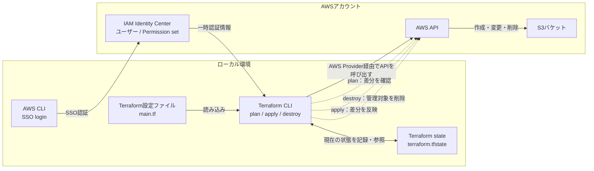

# TerraformでS3バケットを作成・削除する

## TerraformとAWSリソースの関係

Terraformでは、作りたいAWSリソースを設定ファイルに記述し、TerraformがAWS APIを呼び出して実際のリソースを作成・変更・削除する。



### 図の見方

- `main.tf`：作りたいAWSリソースの「あるべき状態」を記述する
- `terraform plan`：設定ファイルとAWSの現在の状態との差分を確認する
- `terraform apply`：差分をAWSに反映する
- `terraform destroy`：Terraformが管理しているリソースを削除する
- `terraform.tfstate`：Terraformが管理対象と実際のAWSリソースを対応付けるための状態情報
- IAM Identity Center：AWSへ接続するためのユーザーと権限を管理する
- AWS Provider：TerraformとAWS APIの間をつなぐプラグイン

重要なのは、Terraformが直接S3を操作するのではなく、AWS Providerを通じてAWS APIを呼び出す点である。また、`terraform.tfstate`はTerraformの管理に必要な情報を含むため、公開リポジトリにコミットしない。

## はじめに

TerraformとAWS CLIをmacOS（Apple Silicon）にセットアップし、AWS IAM Identity Center（旧AWS SSO）で認証して、TerraformからS3バケットを操作する。

この記事では、ルートユーザーを普段の作業に使わず、IAM Identity Centerで作成したユーザーとPermission setを利用する。

## 環境

- Mac：Apple Silicon（M1）
- Terraform：1.16.3
- Terraformの実行対象：`darwin_arm64`
- AWS CLI：2.33.17
- Homebrew：Apple Silicon版（`/opt/homebrew`）
aws-cli/2.33.17 Python/3.13.11 Darwin/25.5.0 exe/arm64
## 1. HomebrewをApple Silicon版にする

※自分は設定がおかしかったので、1の手順を実施していますが関係ない場合はskipしてください。
Intel版Homebrewを使っている場合は、Apple Silicon版に切り替える。M1 Macでは、ARM64版Homebrewを使うのが基本である。Apple Silicon版Homebrewの標準インストール先は`/opt/homebrew`で、Intel版は通常`/usr/local`にインストールされる。

現在のターミナルでARM64版Homebrewを優先する。

```bash
eval "$(/opt/homebrew/bin/brew shellenv)"
```

次回以降も有効にするには、`~/.zprofile`に追加する。

```bash
echo 'eval "$(/opt/homebrew/bin/brew shellenv)"' >> "$HOME/.zprofile"
```

切り替え後は、次のコマンドで確認できる。

```bash
arch
which brew
brew --prefix
```

以下のようになれば、ARM64版Homebrewが使われている。

```text
arm64
/opt/homebrew/bin/brew
/opt/homebrew
```

## 2. Terraformをインストールする

HashiCorpのHomebrew tapを追加し、Terraformをインストールする。

```bash
brew update
brew tap hashicorp/tap
brew install hashicorp/tap/terraform
```

インストールを確認する。

```bash
terraform version
```

出力例：

```text
Terraform v1.16.3
on darwin_arm64
```

### Command Line Toolsでエラーが出る場合

Terraformのインストール時に、次のようなエラーが出ることがある。

```text
Your Command Line Tools are too outdated.
```

この場合は、macOSの「システム設定」→「一般」→「ソフトウェアアップデート」からCommand Line Toolsを更新する。更新が表示されない場合は、次のコマンドで再インストールする。

```bash
sudo rm -rf /Library/Developer/CommandLineTools
xcode-select --install
```

これはMacのCPUアーキテクチャとは別の問題で、ARM64版Homebrewを使っていても、Command Line Toolsが古いとインストールに失敗する。

## 3. AWS CLIをインストールする

```bash
brew install awscli
```

インストールを確認する。バージョン確認には`aws -v`ではなく`aws --version`を使う。

```bash
aws --version
```

出力例：

```text
aws-cli/2.x Python/3.x Darwin/xx.x exe/arm64
```

## 4. AWSの認証設定

TerraformからAWSを操作するには、IAM Identity Centerで作成したユーザーとAWS CLIのSSO認証を使用する。

ユーザー作成、Permission setの割り当て、SSOログイン、Terraformで使用するAWSプロファイルの設定については、次の別記事にまとめた。

→ [IAM Identity CenterとAWS CLIのSSO認証](./aws-iam-identity-center-sso.md)

認証設定後、Terraformを実行する前に、次のコマンドで対象アカウントを確認する。

```bash
aws sts get-caller-identity
```

## 5. TerraformでS3バケットを削除する

リソースを削除する前に、現在のAWSプロファイルとTerraformの実行対象を確認する。

```bash
echo "$AWS_PROFILE"
aws sts get-caller-identity
```

削除対象を確認するには、`terraform plan -destroy`を実行する。

```bash
terraform plan -destroy
```

内容に問題がなければ、次のコマンドで削除する。

```bash
terraform destroy
```

AWSプロファイルをコマンド単位で指定することもできる。

```bash
AWS_PROFILE=YOUR_PROFILE_NAME terraform plan -destroy
AWS_PROFILE=YOUR_PROFILE_NAME terraform destroy
```

## トラブルシューティング：設定ファイルの重複

次のようなエラーが出た場合は、同じTerraform設定を複数のファイルから読み込んでいる可能性がある。

```text
Error: Duplicate required providers configuration
Error: Duplicate provider configuration
Error: Duplicate resource configuration
```

Terraformは、同じディレクトリにある拡張子`.tf`のファイルをすべて設定ファイルとして読み込む。例えば、次のようにバックアップファイルを作成すると、`bk_main.tf`も有効な設定ファイルとして扱われる。

```text
main.tf
bk_main.tf
```

バックアップを残す場合は、拡張子を`.tf`以外に変更する。

```bash
mv bk_main.tf bk_main.tf.bak
```

その後、設定を検証してから削除を実行する。

```bash
terraform validate
terraform plan -destroy
terraform destroy
```

`terraform destroy`はTerraformの設定を読み込めないと開始できない。そのため、まず重複エラーを解消する必要がある。

## セキュリティ上の注意

次の情報は、ブログやGitリポジトリにそのまま掲載しない。

- AWSアカウントID
- IAM Identity Centerのユーザー名
- SSO start URLの組織固有部分
- ARN
- `UserId`やセッション名
- ローカルユーザー名やMacのホスト名
- アクセストークン、アクセスキー、シークレットキー

また、Terraformの状態ファイル（`terraform.tfstate`）にはAWSリソースの情報が含まれる場合があるため、公開リポジトリにはコミットしない。

AWSの設定が終わったところで、CLI とTerraformを使って、AWSリソースを操作していく。

## TerraformでS3のバケットを作成してみる。

> export AWS_PROFILE=YOUR_PROFILE_NAME


main.tfというファイルを作成する。
→これの意図は？意味は？
→awsを最終的にどんな構成にしたいかを伝える設計意図。

`main.tf`は、**Terraformに「AWSを最終的にどんな構成にしたいか」を伝える設計図**です。

ただし、`main.tf`という名前自体に特別な意味はありません。Terraformは、コマンドを実行したディレクトリにあるすべての`.tf`ファイルを自動で読み込みます。

## どこから読み込まれるのか

例えば、次の場所でTerraformを実行するとします。

```text
s3-security-lab/
├ main.tf
├ outputs.tf
└ variables.tf
```

```bash
cd s3-security-lab
terraform plan
```

Terraformは`s3-security-lab`直下にある、

```text
main.tf
outputs.tf
variables.tf
```

をすべて読み込み、**1つの設定として合体させます**。

`main.tf`を明示的に指定する処理や、Reactの`import`のような記述は必要ありません。

```bash
terraform plan
```

を実行すると、現在のディレクトリにある`.tf`ファイルが自動的に読み込まれます。

## `main.tf`という名前は慣習

以下はすべて同じように読み込まれます。

```text
main.tf
s3.tf
provider.tf
banana.tf
```

`banana.tf`でも技術的には動きますが、他の人が困惑するので、一般的には役割ごとに次のような名前を付けます。

```text
terraform.tf   # TerraformとProviderのバージョン
provider.tf    # AWS Providerの設定
main.tf        # 中心となるリソース
variables.tf   # 入力値
outputs.tf     # 実行後に表示する値
```

小規模な学習用プロジェクトでは、全部`main.tf`に書いて問題ありません。

## 今回の`main.tf`がしていること

```hcl
terraform {
  required_version = ">= 1.5.0"

  required_providers {
    aws = {
      source = "hashicorp/aws"
    }
  }
}
```

これはTerraform本体の設定です。

```hcl
required_version = ">= 1.5.0"
```

Terraform 1.5.0以上を使うよう指定しています。

```hcl
required_providers {
  aws = {
    source = "hashicorp/aws"
  }
}
```

AWSを操作するために、HashiCorp公式のAWS Providerを使用すると宣言しています。

`terraform init`を実行すると、この情報をもとにAWS Providerがダウンロードされます。

---

```hcl
provider "aws" {
  region = "ap-northeast-1"

  default_tags {
    tags = {
      Project   = "s3-security-lab"
      ManagedBy = "Terraform"
    }
  }
}
```

これはAWS Providerの設定です。

```hcl
region = "ap-northeast-1"
```

東京リージョンを操作対象にしています。

ただし、S3のバケット名は全世界で一意であり、S3コンソール上もグローバルに見えるため、EC2ほどリージョンを意識しにくい部分はあります。

`default_tags`は、Terraformが作成する対応リソースへ共通タグを付けます。

```text
Project   = s3-security-lab
ManagedBy = Terraform
```

これにより、AWSコンソールで「何の検証用か」「Terraform管理か」を判別できます。

認証情報はここには書きません。Terraformは、ターミナルで指定した以下のプロファイルを利用します。

```bash
export AWS_PROFILE=YOUR_PROFILE_NAME
```

---

```hcl
resource "aws_s3_bucket" "lab" {
  bucket_prefix = "makiharu-s3-security-lab-"
}
```

ここがS3バケットを定義している部分です。

```text
resource
└ AWS上のリソースを管理する宣言

aws_s3_bucket
└ 作成するAWSリソースの種類

lab
└ Terraform内部で使う名前

bucket_prefix
└ 実際のS3バケット名の接頭辞
```

`lab`はAWS上のバケット名ではありません。Terraformコード内で参照する名前です。

例えば、ほかの箇所からは次のように参照します。

```hcl
aws_s3_bucket.lab.id
```

実際のバケット名は、次のようになります。

```text
makiharu-s3-security-lab-abc123xyz
```

`bucket_prefix`を使用しているため、末尾の一意な文字列はTerraform側で追加されます。

---

```hcl
resource "aws_s3_bucket_public_access_block" "lab" {
  bucket = aws_s3_bucket.lab.id

  block_public_acls       = true
  ignore_public_acls      = true
  block_public_policy     = true
  restrict_public_buckets = true
}
```

これは、作成したS3バケットの外部公開を防ぐ設定です。

特に重要なのが次の参照です。

```hcl
bucket = aws_s3_bucket.lab.id
```

これは、

> `aws_s3_bucket.lab`として作成したバケットに、このPublic Access Blockを設定する

という意味です。

この参照によって、Terraformは依存関係も判断します。

```text
S3バケットを作る
        ↓
そのバケットにPublic Access Blockを設定する
```

コードが記述された上下の順番ではなく、この参照関係から実行順序を決めます。

---

```hcl
output "bucket_name" {
  description = "Terraformで作成したS3バケット名"
  value       = aws_s3_bucket.lab.bucket
}
```

これは、作成されたバケット名を実行後に表示する設定です。

```bash
terraform apply
```

の完了後に、次のように表示されます。

```text
Outputs:

bucket_name = "makiharu-s3-security-lab-abc123xyz"
```

後から個別に確認することもできます。

```bash
terraform output bucket_name
```

## ファイルを作っただけではAWSは変わらない

`main.tf`を保存しただけでは、S3バケットは作られません。

```text
main.tfを保存
→ AWSには何も起きない

terraform plan
→ 変更予定を計算するだけ

terraform apply
→ AWS APIを呼び出して実際に作成する
```

実際には次の流れです。

```text
main.tf
  ↓ 読み込み
Terraform
  ↓ AWS Provider
AWS API
  ↓
S3バケット作成
```

## Terraformにおけるディレクトリの意味

Terraformでは、`.tf`ファイル単体よりも**ディレクトリが1つの単位**になります。この単位をルートモジュールと呼びます。

```text
s3-security-lab/  ← ルートモジュール
├ main.tf
├ variables.tf
└ outputs.tf
```

したがって、別のディレクトリで`terraform plan`を実行しても、この`main.tf`は読み込まれません。

```bash
cd s3-security-lab
terraform plan
```

と、対象の`.tf`ファイルがあるディレクトリで実行する必要があります。

要するに、`main.tf`は特別な起動ファイルではありません。**現在のディレクトリにある設計図の一部であり、Terraformがすべての`.tf`をまとめて読み込む**という仕組みです。


「AWS Providerがダウンロードされる」とは、**TerraformからAWS APIを操作するための専用プラグインが、PC内へインストールされる**という意味です。

Terraform本体だけでは、S3やEC2の作り方を知りません。

```text
Terraform本体
「設定を読み、差分を計算する仕組み」

AWS Provider
「S3やEC2をAWS APIで操作する仕組み」
```

## 全体の関係

```text
main.tf
  ↓ 読み込む
Terraform本体
  ↓ AWS Providerへ指示
AWS Provider
  ↓ AWS APIを呼び出す
AWS
  ↓
S3バケット作成
```

例えば、`main.tf`に次の記述があります。

```hcl
terraform {
  required_providers {
    aws = {
      source = "hashicorp/aws"
    }
  }
}
```

これはTerraformに、

> `registry.terraform.io/hashicorp/aws`で公開されているAWS Providerが必要です

と伝えています。

## `terraform init`で起きること

```bash
terraform init
```

を実行すると、おおむね次の処理が行われます。

1. `.tf`ファイルから必要なProviderを確認する
2. Terraform Registryへアクセスする
3. 使用するAWS Providerのバージョンを決める
4. Macに対応したProviderをダウンロードする
5. `.terraform/`へ配置する
6. 選択したバージョンとチェックサムを`.terraform.lock.hcl`へ記録する

MacがApple Siliconなら、macOS ARM64向けの実行ファイルが取得されます。

ディレクトリは、おおむね次の状態になります。

```text
s3-security-lab/
├ .terraform/
│  └ providers/
│     └ registry.terraform.io/
│        └ hashicorp/
│           └ aws/
├ .terraform.lock.hcl
└ main.tf
```

## AWS Providerが担当すること

AWS Providerには、例えば次の処理が実装されています。

* `aws_s3_bucket`をAWSのどのAPIへ変換するか
* S3バケットの作成・更新・削除
* 現在のバケット設定の取得
* AWSのレスポンスをTerraform Stateへ変換
* AWS CLIプロファイルや環境変数からの認証
* AWS APIのエラー処理

例えば、

```hcl
resource "aws_s3_bucket" "lab" {
  bucket_prefix = "makiharu-s3-security-lab-"
}
```

をAWS Providerが解釈し、S3のバケット作成APIを呼び出します。

Terraform本体は、`aws_s3_bucket`の詳細までは知りません。AWS Providerに「このリソースを作って」と依頼します。

## `.terraform.lock.hcl`とは

`.terraform.lock.hcl`には、実際に採用されたProviderのバージョンとチェックサムが記録されます。

イメージとしては次のような内容です。

```hcl
provider "registry.terraform.io/hashicorp/aws" {
  version = "6.x.x"

  hashes = [
    "h1:...",
    "zh:..."
  ]
}
```

役割は次の2つです。

* 次回も同じProviderバージョンを使用する
* ダウンロードしたProviderが改ざんされていないか確認する

`main.tf`のバージョン条件が、

```hcl
version = "~> 6.0"
```

なら、利用可能な6系の中から実際のバージョンを選び、その結果をロックファイルへ固定します。

```text
main.tf
「6系を使用してよい」

.terraform.lock.hcl
「今回は具体的に6.x.xを使用した」
```

## Git管理の違い

| 対象                    | Git管理 | 理由                        |
| --------------------- | ----: | ------------------------- |
| `.terraform/`         |   しない | 再ダウンロードでき、サイズも大きい         |
| `.terraform.lock.hcl` |    する | チームや環境間でProviderバージョンを揃える |
| `main.tf`             |    する | インフラの設計図                  |

別のPCでリポジトリをクローンして`terraform init`を実行すると、ロックファイルに従って同じProviderがダウンロードされます。

## `init`だけではS3は作られない

`terraform init`は作業環境の準備です。

```text
terraform init
→ AWS Providerを用意する
→ S3はまだ作られない

terraform plan
→ AWSの現在状態とコードを比較する

terraform apply
→ ProviderがAWS APIを呼び、S3を作る
```

また、Providerをダウンロードしても、AWS本体やAWS CLI、認証情報がダウンロードされるわけではありません。SSO認証情報は別に管理され、Providerが必要なときにその一時認証情報を利用します。

感覚としては、Terraform本体がゲーム機、AWS ProviderがAWSを操作するための専用ソフト、`.terraform.lock.hcl`が使用ソフトのバージョン固定表です。


HashiCorpのAWS Providerは、Terraformの設定をAWS APIの操作へ変換するアダプター兼実装プラグインです。


### terraformの実行

> terraform init
Initializing the backend...

Initializing provider plugins...
- Finding latest version of hashicorp/aws...
- Installing hashicorp/aws v6.65.0...
- Installed hashicorp/aws v6.65.0 (signed by HashiCorp)

Terraform has created a lock file .terraform.lock.hcl to record the provider
selections it made above. Include this file in your version control repository
so that Terraform can guarantee to make the same selections by default when
you run "terraform init" in the future.

Terraform has been successfully initialized!

You may now begin working with Terraform. Try running "terraform plan" to see
any changes that are required for your infrastructure. All Terraform commands
should now work.

If you ever set or change modules or backend configuration for Terraform,
rerun this command to reinitialize your working directory. If you forget, other
commands will detect it and remind you to do so if necessary.


このような構成になる。
s3-security-lab/
├ .terraform/
│  └ providers/
│     └ registry.terraform.io/
│        └ hashicorp/
│           └ aws/
├ .terraform.lock.hcl
└ main.tf


> terraform plan

> terraform apply

注意。小文字でyesと打たないと、ダメ。Enterだけだと、キャンセル扱いされる。

YOUR_USER@YOUR_HOST s3-security-lab % AWS_PROFILE=YOUR_PROFILE_NAME terraform apply

Terraform used the selected providers to generate the following execution plan. Resource actions are indicated with the following symbols:
  + create

Terraform will perform the following actions:

  # aws_s3_bucket.lab will be created
  + resource "aws_s3_bucket" "lab" {
      + acceleration_status         = (known after apply)
      + acl                         = (known after apply)
      + arn                         = (known after apply)
      + bucket                      = (known after apply)
      + bucket_domain_name          = (known after apply)
      + bucket_namespace            = (known after apply)
      + bucket_prefix               = "makiharu-s3-security-lab-"
      + bucket_region               = (known after apply)
      + bucket_regional_domain_name = (known after apply)
      + force_destroy               = false
      + hosted_zone_id              = (known after apply)
      + id                          = (known after apply)
      + object_lock_enabled         = (known after apply)
      + policy                      = (known after apply)
      + region                      = "ap-northeast-1"
      + request_payer               = (known after apply)
      + tags_all                    = {
          + "ManagedBy" = "Terraform"
          + "Project"   = "s3-security-lab"
        }
      + website_domain              = (known after apply)
      + website_endpoint            = (known after apply)

      + cors_rule (known after apply)

      + grant (known after apply)

      + lifecycle_rule (known after apply)

      + logging (known after apply)

      + object_lock_configuration (known after apply)

      + replication_configuration (known after apply)

      + server_side_encryption_configuration (known after apply)

      + versioning (known after apply)

      + website (known after apply)
    }

  # aws_s3_bucket_public_access_block.lab will be created
  + resource "aws_s3_bucket_public_access_block" "lab" {
      + block_public_acls       = true
      + block_public_policy     = true
      + bucket                  = (known after apply)
      + id                      = (known after apply)
      + ignore_public_acls      = true
      + region                  = "ap-northeast-1"
      + restrict_public_buckets = true
    }

Plan: 2 to add, 0 to change, 0 to destroy.

Changes to Outputs:
  + bucket_name = (known after apply)

Do you want to perform these actions?
  Terraform will perform the actions described above.
  Only 'yes' will be accepted to approve.

  Enter a value: yes

aws_s3_bucket.lab: Creating...
aws_s3_bucket.lab: Creation complete after 1s [id=makiharu-s3-security-lab-c4fe4545a78e64ed34b2027d4c]
aws_s3_bucket_public_access_block.lab: Creating...
aws_s3_bucket_public_access_block.lab: Creation complete after 0s [id=makiharu-s3-security-lab-c4fe4545a78e64ed34b2027d4c]

Apply complete! Resources: 2 added, 0 changed, 0 destroyed.

Outputs:

bucket_name = "makiharu-s3-security-lab-c4fe4545a78e64ed34b2027d4c"

バケットが作成できた！！！


## S3バケットを削除する。

terraform destory

terraform state list
で何も表示されていなければ、管理対象は空。AWSコンソールからも消えている。
